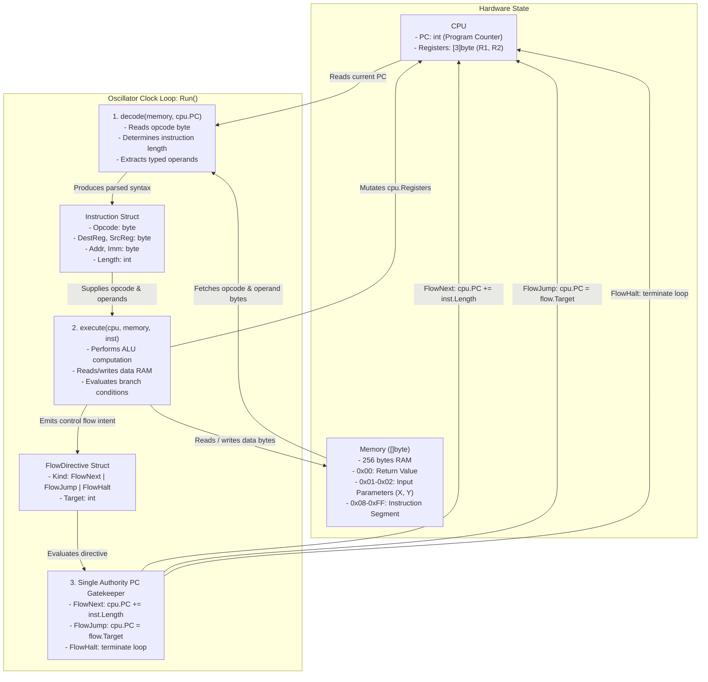

# Curriculum Overview and Methodology

## Test-Driven Hardware Emulation

- Build the virtual machine one layer at a time using Test-Driven Development (TDD).
- For each challenge:
  - Write the test in [bradvm/vm_test.go](file:///Users/bradleyyeo/Documents/learn/csapp3e-brad/BradfieldCSI/ComputerArch/Prework1-VM/bradvm/vm_test.go).
  - Run the test using `go test -v ./...` to verify it fails for the expected reason.
  - Implement the minimal code in [bradvm/vm.go](file:///Users/bradleyyeo/Documents/learn/csapp3e-brad/BradfieldCSI/ComputerArch/Prework1-VM/bradvm/vm.go) to pass the test.
  - Review the architectural concepts and active recall checkpoints before proceeding.

## Conceptual Layering Strategy

- Begin with raw machine code bytes (`[]byte`) rather than symbolic strings to master the underlying binary representation.
- Introduce arithmetic and data transfer before control flow.
- Address architectural flaws identified in [bradvm/CONCEPTS.md](file:///Users/bradleyyeo/Documents/learn/csapp3e-brad/BradfieldCSI/ComputerArch/Prework1-VM/bradvm/CONCEPTS.md) (shallow decoders, coupled Program Counter updates) via structured refactoring milestones.

# Challenge 1: The Oscillator and Halt

## Concept: Hardware Clock and Execution Termination

- A physical CPU requires an oscillating clock signal to drive state transitions across clock cycles.
- In software emulation, an infinite `for` loop acts as the clock generator.
- The machine begins executing instructions starting at address `0x08` (the boundary between data and code space).
- The `Halt` instruction (`0xff`) signals the CPU to stop the clock and terminate execution cleanly.

## Test Specification

- Add the following test to [bradvm/vm_test.go](file:///Users/bradleyyeo/Documents/learn/csapp3e-brad/BradfieldCSI/ComputerArch/Prework1-VM/bradvm/vm_test.go):
  ```go
  func TestHaltMinimal(t *testing.T) {
      memory := make([]byte, 256)
      memory[8] = 0xff // HALT opcode at instruction entry point

      compute(memory)
      // Test passes if function halts and does not loop infinitely
  }
  ```

## Architectural Mechanics

- Memory layout at cycle 0:
  - `memory[0x00]` to `memory[0x07]`: All zero.
  - `memory[0x08]`: `0xff` (`Halt`).
- State variables required:
  - Program Counter: `pc = 8`.
- Fetch phase:
  - Read `opcode := memory[pc]`.
- Execute phase:
  - Detect `opcode == 0xff` and break the loop.

## Implementation Guidelines

- Define opcode constants in [bradvm/vm.go](file:///Users/bradleyyeo/Documents/learn/csapp3e-brad/BradfieldCSI/ComputerArch/Prework1-VM/bradvm/vm.go):
  ```go
  const (
      Halt = 0xff
  )
  ```
- Implement `compute(memory []byte)` with a loop that tracks `pc` starting at 8.
- Break when `opcode == Halt`.

## Active Recall Checkpoint

- What happens in hardware when a CPU receives an unhandled or invalid opcode?
- Why must `pc` initialize to 8 instead of 0 in this specific memory architecture?

# Challenge 2: Direct Memory Access and Register Files

## Concept: The Register File, Bus Transfers, and Instruction Stepping

- The CPU cannot operate on RAM directly without first loading data into on-chip registers.
- Registers provide temporary storage that the ALU and control unit can read and write within a single clock cycle.
- `Load` reads a byte from a memory address into a register.
- `Store` writes a byte from a register into a memory address.
- Both instructions are 3 bytes long:
  - Byte 0: Opcode (`0x01` for `Load`, `0x02` for `Store`).
  - Byte 1: Register identifier (`1` for `r1`, `2` for `r2`).
  - Byte 2: Linear memory address (`0` to `255`).
- The Program Counter must advance by 3 bytes after each non-branch instruction.

## Test Specification

- Add the following test to [bradvm/vm_test.go](file:///Users/bradleyyeo/Documents/learn/csapp3e-brad/BradfieldCSI/ComputerArch/Prework1-VM/bradvm/vm_test.go):
  ```go
  func TestLoadStoreMinimal(t *testing.T) {
      memory := make([]byte, 256)
      memory[1] = 42 // Set input parameter in data segment

      // Program: load r1 [1]; store r1 [0]; halt
      program := []byte{
          0x01, 0x01, 0x01, // load r1, 1
          0x02, 0x01, 0x00, // store r1, 0
          0xff,             // halt
      }
      copy(memory[8:], program)

      compute(memory)

      if memory[0] != 42 {
          t.Fatalf("expected memory[0] to be 42, got %d", memory[0])
      }
  }
  ```

## Architectural Mechanics

- Execution trace:
  - Cycle 1: `pc = 8`. Fetches `0x01` (`Load`). Decodes destination register `1` (`r1`), source address `1`. Executes: `registers[1] = memory[1]` (`42`). Advances: `pc = 8 + 3 = 11`.
  - Cycle 2: `pc = 11`. Fetches `0x02` (`Store`). Decodes source register `1` (`r1`), destination address `0`. Executes: `memory[0] = registers[1]` (`42`). Advances: `pc = 11 + 3 = 14`.
  - Cycle 3: `pc = 14`. Fetches `0xff` (`Halt`). Terminates.

## Implementation Guidelines

- Define constants:
  ```go
  const (
      Load  = 0x01
      Store = 0x02
      Halt  = 0xff
  )
  ```
- Maintain register file state inside `compute`:
  ```go
  var registers [3]byte // registers[1] is r1, registers[2] is r2
  ```
- For 3-byte instructions, fetch operands at `memory[pc+1]` and `memory[pc+2]`.
- Increment `pc += 3` after execution.

## Active Recall Checkpoint

- What are the tradeoffs between fixed-length 3-byte instructions and variable-length instructions?
- In physical silicon, what physical buses are energized during a `Load` vs a `Store`?

# Challenge 3: Arithmetic Logic Unit Operations and Two's Complement

## Concept: Integer Arithmetic, Overflows, and Register-to-Register Operations

- The Arithmetic Logic Unit (ALU) performs computation on register operands.
- `Add` (`0x03`) and `Sub` (`0x04`) are 3-byte register-to-register instructions:
  - Byte 0: Opcode.
  - Byte 1: Destination register (`r1` or `r2`).
  - Byte 2: Source register (`r1` or `r2`).
- Semantics:
  - `Add r1 r2` $\rightarrow$ `r1 = r1 + r2`.
  - `Sub r1 r2` $\rightarrow$ `r1 = r1 - r2`.
- Overflow behavior: 8-bit unsigned integers wrap modulo 256 without error conditions.
  - `254 + 1 = 255`
  - `255 + 1 = 0` (overflow)
  - `0 - 1 = 255` (underflow / borrow)

## Test Specification

- Add tests covering normal arithmetic and overflow boundaries to [bradvm/vm_test.go](file:///Users/bradleyyeo/Documents/learn/csapp3e-brad/BradfieldCSI/ComputerArch/Prework1-VM/bradvm/vm_test.go):
  ```go
  func TestAddAndSubtract(t *testing.T) {
      cases := []struct {
          name     string
          x, y     byte
          isSub    bool
          expected byte
      }{
          {"AddNormal", 10, 20, false, 30},
          {"AddOverflow", 255, 1, false, 0},
          {"SubNormal", 20, 5, true, 15},
          {"SubUnderflow", 0, 1, true, 255},
      }

      for _, tc := range cases {
          t.Run(tc.name, func(t *testing.T) {
              memory := make([]byte, 256)
              memory[1] = tc.x
              memory[2] = tc.y

              op := byte(0x03) // Add
              if tc.isSub {
                  op = 0x04 // Sub
              }

              program := []byte{
                  0x01, 0x01, 0x01, // load r1, 1
                  0x01, 0x02, 0x02, // load r2, 2
                  op, 0x01, 0x02,   // add/sub r1, r2
                  0x02, 0x01, 0x00, // store r1, 0
                  0xff,             // halt
              }
              copy(memory[8:], program)

              compute(memory)

              if memory[0] != tc.expected {
                  t.Fatalf("expected %d, got %d", tc.expected, memory[0])
              }
          })
      }
  }
  ```

## Architectural Mechanics

- The ALU does not touch memory; it receives inputs strictly from the register file.
- The result of the ALU operation is written back to the destination register during the writeback phase of the clock cycle.

## Implementation Guidelines

- Define constants:
  ```go
  const (
      Add = 0x03
      Sub = 0x04
  )
  ```
- Implement dispatch cases for `Add` and `Sub` reading register indices from `memory[pc+1]` and `memory[pc+2]`.

## Active Recall Checkpoint

- Why does `uint8(255) + uint8(1)` wrap to `0` in Go without throwing an exception?
- How does hardware detect whether an arithmetic result overflowed (hint: status/flags register)?

# Challenge 4: Immediate Addressing Modes

## Concept: Constants in the Instruction Stream

- Register-to-register arithmetic requires both operands to be loaded into registers first.
- If an algorithm needs to add or subtract a known constant (e.g., decrementing a loop counter by 1), storing that constant in data memory and loading it waste memory bus cycles.
- Immediate instructions (`Addi = 0x05`, `Subi = 0x06`) embed the literal operand directly inside Byte 2 of the instruction:
  - Byte 0: Opcode.
  - Byte 1: Destination register.
  - Byte 2: Literal integer constant.
- Semantics:
  - `Addi r1 3` $\rightarrow$ `registers[r1] = registers[r1] + 3`.
  - `Subi r1 1` $\rightarrow$ `registers[r1] = registers[r1] - 1`.

## Test Specification

- Add the following test to [bradvm/vm_test.go](file:///Users/bradleyyeo/Documents/learn/csapp3e-brad/BradfieldCSI/ComputerArch/Prework1-VM/bradvm/vm_test.go):
  ```go
  func TestImmediateArithmetic(t *testing.T) {
      memory := make([]byte, 256)
      memory[1] = 20 // Input X

      program := []byte{
          0x01, 0x01, 0x01, // load r1, 1 (r1 = 20)
          0x05, 0x01, 0x03, // addi r1, 3 (r1 = 23)
          0x06, 0x01, 0x05, // subi r1, 5 (r1 = 18)
          0x02, 0x01, 0x00, // store r1, 0
          0xff,             // halt
      }
      copy(memory[8:], program)

      compute(memory)

      if memory[0] != 18 {
          t.Fatalf("expected memory[0] to be 18, got %d", memory[0])
      }
  }
  ```

## Architectural Mechanics

- The second operand is sourced directly from the Instruction Register / instruction buffer, bypassing the register read port.
- This cuts memory references by half compared to `load r2 [constant_addr]` followed by `add r1 r2`.

## Implementation Guidelines

- Add constants:
  ```go
  const (
      Addi = 0x05
      Subi = 0x06
  )
  ```
- In the execution switch, treat operand 2 as a literal byte value rather than a register index.

## Active Recall Checkpoint

- What is the maximum constant value that can be represented in an immediate field of 1 byte?
- How do 64-bit architectures like x86-64 handle large 64-bit immediate values?

# Challenge 5: Control Flow Diversion and Absolute Jumps

## Concept: The Program Counter as an Invariant State Register

- Linear sequential execution (`pc += length`) is insufficient for algorithms requiring branches or loops.
- An unconditional `Jump` (`0x07`) overrides the sequential increment by setting the Program Counter directly to a target memory address.
- `Jump` is a 2-byte instruction:
  - Byte 0: Opcode (`0x07`).
  - Byte 1: Target address (`0` to `255`).
- Critical invariant: When a `Jump` executes, the default `pc += length` step must NOT run; the PC must take on the target address immediately.

## Test Specification

- Add the following test to [bradvm/vm_test.go](file:///Users/bradleyyeo/Documents/learn/csapp3e-brad/BradfieldCSI/ComputerArch/Prework1-VM/bradvm/vm_test.go):
  ```go
  func TestJump(t *testing.T) {
      memory := make([]byte, 256)
      memory[1] = 42

      // Program layout:
      // Address 8:  load r1, 1       (3 bytes: 8, 9, 10)
      // Address 11: jump 17          (2 bytes: 11, 12)
      // Address 13: store r1, 0      (3 bytes: 13, 14, 15) -> SHOULD BE SKIPPED
      // Address 16: halt             (1 byte: 16)          -> Landing point
      program := []byte{
          0x01, 0x01, 0x01, // 8:  load r1, 1
          0x07, 0x10,       // 11: jump 16 (0x10)
          0x02, 0x01, 0x00, // 13: store r1, 0 (skipped)
          0xff,             // 16: halt
      }
      copy(memory[8:], program)

      compute(memory)

      // Since store was jumped over, memory[0] must remain 0
      if memory[0] != 0 {
          t.Fatalf("expected memory[0] to be 0 (skipped store), got %d", memory[0])
      }
  }
  ```

## Architectural Mechanics

- Target address calculation: Direct assignment `pc = targetAddress`.
- Because `Jump` is 2 bytes while other instructions are 3 bytes (or 1 byte for `Halt`), the VM architecture must handle variable instruction lengths.

## Implementation Guidelines

- Add constant:
  ```go
  const Jump = 0x07
  ```
- Guard the natural PC increment so that when `opcode == Jump`, the PC is not incremented further.

## Active Recall Checkpoint

- What is the difference between an absolute jump and a relative jump?
- Why can absolute jumps become problematic when code must be relocated to different base addresses in memory?

# Challenge 6: Conditional Branching and Relative Addressing

## Concept: Predicated Execution and PC-Relative Offsets

- Conditional control flow allows a program to make decisions based on runtime data.
- `Beqz` (`0x08` - Branch if Equal to Zero) evaluates a register; if the register holds zero, execution jumps by a relative offset.
- `Beqz` is a 3-byte instruction:
  - Byte 0: Opcode (`0x08`).
  - Byte 1: Evaluation register (`r1` or `r2`).
  - Byte 2: Forward offset (number of bytes to skip).
- Single Authority PC Principle:
  - In [introduction-prework/vm.go](file:///Users/bradleyyeo/Documents/learn/csapp3e-brad/BradfieldCSI/ComputerArch/Prework1-VM/introduction-prework/vm.go#L89-L93), `beqzProcedure` adds `offset` to `pc`, and then the outer loop *also* adds `maxOffset + 1 = 3`.
  - This dual authority creates temporal coupling where the offset must be written relative to the instruction end rather than the current instruction pointer.
  - In your implementation, ensure control flow updates are transparent and clearly defined.

## Test Specification

- Add tests for both taken and not-taken branch conditions to [bradvm/vm_test.go](file:///Users/bradleyyeo/Documents/learn/csapp3e-brad/BradfieldCSI/ComputerArch/Prework1-VM/bradvm/vm_test.go):
  ```go
  func TestBeqz(t *testing.T) {
      cases := []struct {
          name     string
          r2Value  byte
          expected byte
      }{
          {"BranchTakenWhenZero", 0, 0},     // r2 is 0 -> branch over store -> memory[0] stays 0
          {"FallthroughWhenNonZero", 1, 42}, // r2 is 1 -> execute store -> memory[0] becomes 42
      }

      for _, tc := range cases {
          t.Run(tc.name, func(t *testing.T) {
              memory := make([]byte, 256)
              memory[1] = 42
              memory[2] = tc.r2Value

              // Layout:
              // 8:  load r1, 1       (3 bytes: 8..10)
              // 11: load r2, 2       (3 bytes: 11..13)
              // 14: beqz r2, 3       (3 bytes: 14..16) -> skip 3-byte store instruction
              // 17: store r1, 0      (3 bytes: 17..19)
              // 20: halt             (1 byte: 20)
              program := []byte{
                  0x01, 0x01, 0x01, // 8:  load r1, 1
                  0x01, 0x02, 0x02, // 11: load r2, 2
                  0x08, 0x02, 0x03, // 14: beqz r2, 3
                  0x02, 0x01, 0x00, // 17: store r1, 0
                  0xff,             // 20: halt
              }
              copy(memory[8:], program)

              compute(memory)

              if memory[0] != tc.expected {
                  t.Fatalf("expected memory[0] to be %d, got %d", tc.expected, memory[0])
              }
          })
      }
  }
  ```

## Architectural Mechanics

- When condition is true (`registers[r2] == 0`):
  - Next PC = Target after the skipped block.
- When condition is false (`registers[r2] != 0`):
  - Next PC = Normal sequential progression (`pc + 3`).

## Implementation Guidelines

- Add constant:
  ```go
  const Beqz = 0x08
  ```
- Implement the conditional evaluation:
  - If register value is zero, add the offset to the sequential progression.
  - If register value is non-zero, proceed sequentially.

## Active Recall Checkpoint

- Why do compilers prefer relative branches over absolute jumps for local loops and `if/else` statements?
- What happens if an offset wraps the 8-bit Program Counter past 255?

# Virtual Machine Architecture of `bradvm`

## Architectural Pipeline and Data Flow



## Architectural Design Principles

### Daniel Jackson's Concept Design
- Hardware State (`CPU`):
  - Encapsulates physical processor registers (`PC`, `Registers`) and enforces valid reset vector invariants via `NewCPU()`.
- Machine Syntax (`Instruction`):
  - Represents the typed, decoded form of machine code bytes, decoupling operand representation from raw memory indexing.
- Control Flow Intent (`FlowDirective`):
  - Models branching and program counter transitions without coupling execution units to register mutation.

### John Ousterhout's Deep Modules
- Deep Decoder:
  - `decode(memory []byte, pc int) (Instruction, error)` hides all variable-length byte parsing, opcode mapping, and operand indexing behind a clean interface.
- Pure Execution Unit:
  - `execute(cpu *CPU, memory []byte, inst Instruction) (FlowDirective, error)` isolates state transitions from oscillator loop management.

### Jimmy Koppel's Single Authority Principle
- Program Counter Gatekeeper:
  - Neither `decode()` nor `execute()` mutates `cpu.PC` directly.
  - The oscillator loop in `Run()` acts as the sole authoritative component updating `cpu.PC`, eliminating distributed mutations, race conditions, and off-by-one errors.


# Challenge 8: Assembler Construction and Algorithmic Execution

## Concept: Machine Instruction Encoding and Algorithmic Loops (CS:APP 3.2, 3.5, 3.6)

- In CS:APP Chapter 3, programs are represented as sequences of raw binary instructions, but authored in symbolic assembly.
- Writing machine code as raw byte slices is error-prone and obscures algorithmic control structures.
- An assembler acts as a 1:1 translator:
  - Parses symbolic instruction mnemonics (`load`, `store`, `add`, `subi`, `jump`, `beqz`, `halt`).
  - Converts human-readable tokens directly into executable binary bytes.
- The `Sum to n` program tests all architectural components working in harmony:
  - Parameter loading (`Load`).
  - Loop termination condition (`Beqz`).
  - Accumulation (`Add`).
  - Loop counter decrement (`Subi`).
  - Unconditional backward loop jump (`Jump`).
  - Writeback to memory address `0x00` (`Store`).
  - Clean termination (`Halt`).

## Test Specification

- Add the following test to [bradvm/vm_test.go](file:///Users/bradleyyeo/Documents/learn/csapp3e-brad/BradfieldCSI/ComputerArch/Prework1-VM/bradvm/vm_test.go):
  ```go
  func TestSumToN(t *testing.T) {
      asm := `
  load r1, 1
  beqz r1, 8
  add r2, r1
  subi r1, 1
  jump 11
  store r2, 0
  halt`

      testCases := []struct {
          n        byte
          expected byte
      }{
          {0, 0},   // sum(0) = 0
          {1, 1},   // sum(1) = 1
          {5, 15},  // sum(5) = 1 + 2 + 3 + 4 + 5 = 15
          {10, 55}, // sum(10) = 55
      }

      bytecode, err := assemble(asm)
      if err != nil {
          t.Fatalf("assembly failed: %v", err)
      }

      for _, tc := range testCases {
          memory := make([]byte, 256)
          memory[1] = tc.n
          copy(memory[8:], bytecode)

          Run(memory)

          if memory[0] != tc.expected {
              t.Fatalf("for n=%d, expected %d, got %d", tc.n, tc.expected, memory[0])
          }
      }
  }
  ```

## Architectural Mechanics

### Execution Trace for $n = 3$
- `load r1, 1`: `r1 = 3`.
- Loop iteration 1: `r1 != 0` (branch not taken). `r2 = 0 + 3 = 3`. `r1 = 3 - 1 = 2`. `jump 11`.
- Loop iteration 2: `r1 != 0`. `r2 = 3 + 2 = 5`. `r1 = 2 - 1 = 1`. `jump 11`.
- Loop iteration 3: `r1 != 0`. `r2 = 5 + 1 = 6`. `r1 = 1 - 1 = 0`. `jump 11`.
- Loop iteration 4: `r1 == 0`. `beqz r1, 8` takes branch, skipping forward 8 bytes past `add`, `subi`, `jump`.
- Land at `store r2, 0`: `memory[0] = 6`.
- `halt`: Execution halts cleanly.

## Implementation Guidelines

- Implement `assemble(asm string) ([]byte, error)` in [bradvm/vm.go](file:///Users/bradleyyeo/Documents/learn/csapp3e-brad/BradfieldCSI/ComputerArch/Prework1-VM/bradvm/vm.go) (or a dedicated `assembler.go` in [bradvm/](file:///Users/bradleyyeo/Documents/learn/csapp3e-brad/BradfieldCSI/ComputerArch/Prework1-VM/bradvm)):
  - Split input by newlines and trim whitespace.
  - Ignore empty lines and comments (`#` or `//`).
  - Tokenize instruction mnemonics and operands separated by commas or whitespace.
  - Map instruction mnemonics to opcode constants ([Load](file:///Users/bradleyyeo/Documents/learn/csapp3e-brad/BradfieldCSI/ComputerArch/Prework1-VM/bradvm/vm.go#L8), [Store](file:///Users/bradleyyeo/Documents/learn/csapp3e-brad/BradfieldCSI/ComputerArch/Prework1-VM/bradvm/vm.go#L9), [Add](file:///Users/bradleyyeo/Documents/learn/csapp3e-brad/BradfieldCSI/ComputerArch/Prework1-VM/bradvm/vm.go#L10), etc.).
  - Map `"r1"` $\rightarrow 1$, `"r2"` $\rightarrow 2$.
  - Parse integers using `strconv.Atoi`.

## Active Recall Checkpoint

- What is the conceptual difference between an assembler (1:1 mapping) and a compiler (1:many mapping)?
- Trace how `jump 11` targets the `beqz` instruction: why address 11? (Hint: sum the byte lengths of all preceding instructions starting at address 8).

# Challenge 9: Hardware Exception Traps and Processor Status Codes

## Concept: Processor Status Codes and Exception Vectors (CS:APP 4.1.4, 8.1)

- In CS:APP Chapter 4 (Y86-64), a processor tracks its execution state through a status code register (`Stat`):
  - `AOK` (`1`): Normal operation.
  - `HLT` (`2`): Processor executed a halt instruction.
  - `ADR` (`3`): Invalid memory address accessed.
  - `INS` (`4`): Invalid instruction opcode encountered.
- Physical CPUs do not crash or trigger host language panics when an illegal instruction or memory violation occurs.
- Instead, hardware traps raise an internal exception, capture the fault code into a status register, and halt the clock with a distinct state.
- In your refactored architecture, [decode](file:///Users/bradleyyeo/Documents/learn/csapp3e-brad/BradfieldCSI/ComputerArch/Prework1-VM/bradvm/vm.go#L52) and [execute](file:///Users/bradleyyeo/Documents/learn/csapp3e-brad/BradfieldCSI/ComputerArch/Prework1-VM/bradvm/vm.go#L119) report structured hardware traps rather than invoking Go's `panic()`.

## Test Specification

- Add the following test to [bradvm/vm_test.go](file:///Users/bradleyyeo/Documents/learn/csapp3e-brad/BradfieldCSI/ComputerArch/Prework1-VM/bradvm/vm_test.go):
  ```go
  func TestTrapHandling(t *testing.T) {
      cases := []struct {
          name         string
          program      []byte
          expectedTrap byte
      }{
          {
              name: "IllegalOpcode",
              program: []byte{
                  0xee, // Undefined opcode
              },
              expectedTrap: 0x02, // TrapIllegalOpcode (INS in CS:APP 4.1.4)
          },
          {
              name: "InvalidRegister",
              program: []byte{
                  0x01, 0x05, 0x01, // load r5, 1 (r5 does not exist)
              },
              expectedTrap: 0x03, // TrapInvalidRegister
          },
          {
              name: "MemoryOutOfBounds",
              program: []byte{
                  0x07, 0xfe, // jump 254 (target instruction crosses 256-byte boundary)
              },
              expectedTrap: 0x04, // TrapMemoryOutOfBounds (ADR in CS:APP 4.1.4)
          },
      }

      for _, tc := range cases {
          t.Run(tc.name, func(t *testing.T) {
              memory := make([]byte, 256)
              copy(memory[8:], tc.program)

              trap := RunWithTrap(memory)
              if trap != tc.expectedTrap {
                  t.Fatalf("expected trap 0x%02x, got 0x%02x", tc.expectedTrap, trap)
              }
          })
      }
  }
  ```

## Architectural Mechanics

### Validation in the Pipeline Stages
- Fetch & Decode Stage ([decode](file:///Users/bradleyyeo/Documents/learn/csapp3e-brad/BradfieldCSI/ComputerArch/Prework1-VM/bradvm/vm.go#L52)):
  - Validates that `pc < len(memory)`.
  - Determines instruction length; validates `pc + inst.Length <= len(memory)`.
  - If out of bounds: returns `TrapMemoryOutOfBounds`.
  - If opcode unrecognized: returns `TrapIllegalOpcode`.
- Execute Stage ([execute](file:///Users/bradleyyeo/Documents/learn/csapp3e-brad/BradfieldCSI/ComputerArch/Prework1-VM/bradvm/vm.go#L119)):
  - Validates that register identifiers are valid (`inst.DestReg <= 2` and `inst.SrcReg <= 2`).
  - If invalid: returns `TrapInvalidRegister`.
- Oscillator Loop ([Run](file:///Users/bradleyyeo/Documents/learn/csapp3e-brad/BradfieldCSI/ComputerArch/Prework1-VM/bradvm/vm.go#L162)):
  - Catches the trap from `decode` or `execute`, halts the clock, and records the exit status code.

## Implementation Guidelines

- Define trap constants in [bradvm/vm.go](file:///Users/bradleyyeo/Documents/learn/csapp3e-brad/BradfieldCSI/ComputerArch/Prework1-VM/bradvm/vm.go):
  ```go
  const (
      TrapNone              byte = 0x00 // AOK
      TrapHalt              byte = 0x01 // HLT
      TrapIllegalOpcode     byte = 0x02 // INS
      TrapInvalidRegister   byte = 0x03
      TrapMemoryOutOfBounds byte = 0x04 // ADR
  )
  ```
- Implement `RunWithTrap(memory []byte) byte`:
  - Returns the final trap code instead of panicking.
- Refactor [Run](file:///Users/bradleyyeo/Documents/learn/csapp3e-brad/BradfieldCSI/ComputerArch/Prework1-VM/bradvm/vm.go#L162) to call `RunWithTrap` and panic only if a fatal trap occurs (maintaining backward test compatibility).

## Active Recall Checkpoint

- How does CS:APP 4.1.4 define the `Stat` register, and how do `ADR` and `INS` protect physical hardware?
- In Linux systems (CS:APP 8.1), how does the OS kernel handle an Undefined Opcode (`#UD`) hardware exception raised by the CPU?

# Challenge 10: Processor Status Register (FLAGS) and Decoupled Predication

## Concept: ALU Condition Codes and Branch Predication (CS:APP 3.6.1, 4.3)

- In `Beqz`, zero checking is tightly coupled to a single branch instruction.
- Real CPUs (x86-64 and CS:APP Y86-64 SEQ) separate arithmetic computation from control flow decisions:
  - The ALU automatically computes 1-bit condition flags on every arithmetic operation, storing them in a dedicated Status Register (`FLAGS` or `CC`):
    - Zero Flag ($ZF$, bit 0): Set if computation result equals 0.
    - Sign Flag ($SF$, bit 1): Set if the most significant bit (bit 7) is 1 (negative in two's complement).
    - Carry Flag ($CF$, bit 2): Set if unsigned addition overflows past 255 or unsigned subtraction borrows below 0.
    - Overflow Flag ($OF$, bit 3): Set if signed two's complement addition/subtraction produces an erroneous sign bit.
- Control flow instructions inspect condition codes without taking register arguments:
  - `Beq` (`0x09 <offset>`): Branch if $ZF = 1$ (equal / zero).
  - `Bne` (`0x0a <offset>`): Branch if $ZF = 0$ (not equal / non-zero).
- The `Cmp` (`0x0b <r1> <r2>`) instruction performs $r1 - r2$, updates the condition flags, and discards the numerical result without modifying either general-purpose register.

## Test Specification

- Add the following test to [bradvm/vm_test.go](file:///Users/bradleyyeo/Documents/learn/csapp3e-brad/BradfieldCSI/ComputerArch/Prework1-VM/bradvm/vm_test.go):
  ```go
  func TestStatusFlagsAndConditionalBranch(t *testing.T) {
      cases := []struct {
          name         string
          r1Val, r2Val byte
          expectBranch bool
      }{
          {"ValuesEqual", 42, 42, true},
          {"ValuesNotEqual", 42, 99, false},
      }

      for _, tc := range cases {
          t.Run(tc.name, func(t *testing.T) {
              memory := make([]byte, 256)
              memory[1] = tc.r1Val
              memory[2] = tc.r2Val

              // Program layout:
              // 8:  load r1, 1      (3 bytes: 8..10)
              // 11: load r2, 2      (3 bytes: 11..13)
              // 14: cmp r1, r2      (3 bytes: 14..16) -> updates ZF in cpu.Flags
              // 17: beq 3           (2 bytes: 17..18) -> if ZF=1, skip 3-byte store
              // 19: store r1, 0     (3 bytes: 19..21)
              // 22: halt            (1 byte: 22)
              program := []byte{
                  0x01, 0x01, 0x01, // load r1, 1
                  0x01, 0x02, 0x02, // load r2, 2
                  0x0b, 0x01, 0x02, // cmp r1, r2
                  0x09, 0x03,       // beq +3
                  0x02, 0x01, 0x00, // store r1, 0
                  0xff,             // halt
              }
              copy(memory[8:], program)

              Run(memory)

              if tc.expectBranch && memory[0] != 0 {
                  t.Fatalf("expected branch taken (memory[0] == 0), got %d", memory[0])
              }
              if !tc.expectBranch && memory[0] != tc.r1Val {
                  t.Fatalf("expected fallthrough (memory[0] == %d), got %d", tc.r1Val, memory[0])
              }
          })
      }
  }
  ```

## Architectural Mechanics

### Updating the Execute Stage (CS:APP 4.3.2)
- Update [CPU](file:///Users/bradleyyeo/Documents/learn/csapp3e-brad/BradfieldCSI/ComputerArch/Prework1-VM/bradvm/vm.go#L28) struct:
  ```go
  type CPU struct {
      PC        int
      Registers [3]byte
      Flags     byte
  }
  ```
- During [execute](file:///Users/bradleyyeo/Documents/learn/csapp3e-brad/BradfieldCSI/ComputerArch/Prework1-VM/bradvm/vm.go#L119), arithmetic instructions ([Add](file:///Users/bradleyyeo/Documents/learn/csapp3e-brad/BradfieldCSI/ComputerArch/Prework1-VM/bradvm/vm.go#L10), [Sub](file:///Users/bradleyyeo/Documents/learn/csapp3e-brad/BradfieldCSI/ComputerArch/Prework1-VM/bradvm/vm.go#L11), [Addi](file:///Users/bradleyyeo/Documents/learn/csapp3e-brad/BradfieldCSI/ComputerArch/Prework1-VM/bradvm/vm.go#L12), [Subi](file:///Users/bradleyyeo/Documents/learn/csapp3e-brad/BradfieldCSI/ComputerArch/Prework1-VM/bradvm/vm.go#L13), `Cmp`) update `cpu.Flags`:
  - Calculate `val`: result of operation.
  - If `val == 0`: set `FlagZ`.
  - If `val & 0x80 != 0`: set `FlagS`.
  - For addition: set `FlagC` if `result > 255`.
  - For subtraction / comparison: set `FlagC` if `r1 < r2` (borrow occurred).
  - Set `FlagV` if signed overflow occurred.
- `Cmp` disables register writeback while enabling `cpu.Flags` latching.
- `Beq` evaluates `cpu.Flags & FlagZ != 0`:
  - If true: returns `FlowDirective{Kind: FlowJump, Target: cpu.PC + inst.Length + int(offset)}`.
  - If false: returns `FlowDirective{Kind: FlowNext}`.

## Implementation Guidelines

- Define flag masks in [bradvm/vm.go](file:///Users/bradleyyeo/Documents/learn/csapp3e-brad/BradfieldCSI/ComputerArch/Prework1-VM/bradvm/vm.go):
  ```go
  const (
      FlagZ byte = 1 << 0 // Zero Flag
      FlagS byte = 1 << 1 // Sign Flag
      FlagC byte = 1 << 2 // Carry Flag
      FlagV byte = 1 << 3 // Overflow Flag
  )
  ```
- Add opcodes:
  ```go
  const (
      Beq = 0x09
      Bne = 0x0a
      Cmp = 0x0b
  )
  ```

## Active Recall Checkpoint

- How does the ALU calculate the signed overflow flag ($OF$) for an 8-bit two's complement addition? (Hint: compare the signs of operands and result).
- Why does CS:APP 4.3 separate the comparison (`cmp`) from the jump (`jxx`), rather than combining them into a single instruction?

# Challenge 11: Call Stack, Subroutines, and Activation Frames

## Concept: Procedure Control Transfer and the Runtime Stack (CS:APP 3.7, 4.3)

- CS:APP Chapter 3.7 explains how procedures are implemented in hardware:
  - Passing control: Diverting the PC to the starting address of the procedure.
  - Passing data: Placing parameters in designated registers.
  - Allocating and freeing memory: Managing stack frames on the call stack.
- Without a call stack, a subroutine cannot be invoked from multiple call sites because the return address cannot be restored dynamically.
- The Call Stack mechanism:
  - Stack Pointer (`SP`): A dedicated CPU register pointing to the top of the active stack frame.
  - The stack grows downwards in memory from `0xff` down towards `0x00`.
  - `Call <addr>` (`0x0c <addr>`):
    - Pushes the continuation address ($\text{cpu.PC} + \text{inst.Length}$) onto `memory[cpu.SP]`.
    - Decrements `cpu.SP--`.
    - Diverts $\text{cpu.PC} \leftarrow \text{target}$.
  - `Ret` (`0x0d`):
    - Increments `cpu.SP++`.
    - Pops the return address from `memory[cpu.SP]` into `cpu.PC`.

## Test Specification

- Add the following test to [bradvm/vm_test.go](file:///Users/bradleyyeo/Documents/learn/csapp3e-brad/BradfieldCSI/ComputerArch/Prework1-VM/bradvm/vm_test.go):
  ```go
  func TestSubroutineCallAndReturn(t *testing.T) {
      memory := make([]byte, 256)
      memory[1] = 5 // Input X

      // Program layout:
      // 8:  load r1, 1       (3 bytes: 8..10)  -> r1 = 5
      // 11: call 20          (2 bytes: 11..12) -> return address is 13
      // 13: store r1, 0      (3 bytes: 13..15) -> store result
      // 16: halt             (1 byte: 16)
      //
      // Subroutine: DoubleValue at address 20 (0x14)
      // 20: add r1, r1       (3 bytes: 20..22) -> r1 = r1 + r1
      // 23: ret              (1 byte: 23)      -> returns to 13
      program := []byte{
          0x01, 0x01, 0x01, // 8:  load r1, 1
          0x0c, 0x14,       // 11: call 20
          0x02, 0x01, 0x00, // 13: store r1, 0
          0xff,             // 16: halt
      }
      copy(memory[8:], program)

      subroutine := []byte{
          0x03, 0x01, 0x01, // 20: add r1, r1
          0x0d,             // 23: ret
      }
      copy(memory[20:], subroutine)

      Run(memory)

      if memory[0] != 10 {
          t.Fatalf("expected memory[0] to be 10, got %d", memory[0])
      }
  }
  ```

## Architectural Mechanics

### Stack Frame Transitions
- At initialization ([NewCPU](file:///Users/bradleyyeo/Documents/learn/csapp3e-brad/BradfieldCSI/ComputerArch/Prework1-VM/bradvm/vm.go#L46)): `cpu.SP = 0xff`.
- When `Call 20` executes at PC 11:
  - Continuation address is $11 + 2 = 13$.
  - Byte `13` is written to `memory[0xff]`.
  - `cpu.SP` decrements to `0xfe`.
  - [execute](file:///Users/bradleyyeo/Documents/learn/csapp3e-brad/BradfieldCSI/ComputerArch/Prework1-VM/bradvm/vm.go#L119) returns `FlowDirective{Kind: FlowJump, Target: 20}`.
- When `Ret` executes at PC 23:
  - `cpu.SP` increments to `0xff`.
  - Byte `memory[0xff]` (`13`) is read.
  - [execute](file:///Users/bradleyyeo/Documents/learn/csapp3e-brad/BradfieldCSI/ComputerArch/Prework1-VM/bradvm/vm.go#L119) returns `FlowDirective{Kind: FlowJump, Target: 13}`.
  - Execution resumes sequentially at address 13.

## Implementation Guidelines

- Define opcodes:
  ```go
  const (
      Call = 0x0c
      Ret  = 0x0d
  )
  ```
- Update [CPU](file:///Users/bradleyyeo/Documents/learn/csapp3e-brad/BradfieldCSI/ComputerArch/Prework1-VM/bradvm/vm.go#L28) struct:
  ```go
  type CPU struct {
      PC        int
      Registers [3]byte
      Flags     byte
      SP        byte
  }
  ```
- Initialize `SP: 0xff` in [NewCPU](file:///Users/bradleyyeo/Documents/learn/csapp3e-brad/BradfieldCSI/ComputerArch/Prework1-VM/bradvm/vm.go#L46).
- Implement `Call` and `Ret` in [decode](file:///Users/bradleyyeo/Documents/learn/csapp3e-brad/BradfieldCSI/ComputerArch/Prework1-VM/bradvm/vm.go#L52) and [execute](file:///Users/bradleyyeo/Documents/learn/csapp3e-brad/BradfieldCSI/ComputerArch/Prework1-VM/bradvm/vm.go#L119).

## Active Recall Checkpoint

- In x86-64 (CS:APP 3.7), what register acts as the hardware stack pointer, and why does the stack grow toward lower memory addresses?
- What security vulnerability (CS:APP 3.10.3) arises when an attacker writes beyond a buffer allocated on the stack to overwrite the return address?

# Challenge 12: Register-Indirect Addressing and Pointer Dereferencing

## Concept: Pointers and Dynamically Computed Memory Addresses (CS:APP 3.8, 4.3)

- Direct memory addressing (`Load` and `Store`) hardcodes the linear memory target in the instruction bytes at compile time.
- Dynamic data structures (arrays, buffers, linked nodes) require computing memory addresses at runtime.
- Register-indirect addressing uses a general-purpose register as a pointer:
  - `LoadInd rDest, rAddr` (`0x0e <dest> <addr_reg>`): Reads `memory[cpu.Registers[rAddr]]` into `cpu.Registers[rDest]`.
  - `StoreInd rSrc, rAddr` (`0x0f <src> <addr_reg>`): Writes `cpu.Registers[rSrc]` into `memory[cpu.Registers[rAddr]]`.
- Together with immediate arithmetic (`addi rAddr, 1`), indirect addressing enables pointer loops and buffer scanning.

## Test Specification

- Add the following test to [bradvm/vm_test.go](file:///Users/bradleyyeo/Documents/learn/csapp3e-brad/BradfieldCSI/ComputerArch/Prework1-VM/bradvm/vm_test.go):
  ```go
  func TestIndirectAddressingArraySum(t *testing.T) {
      memory := make([]byte, 256)
      // Array data stored at addresses 0x20..0x22: [10, 20, 30]
      memory[0x20] = 10
      memory[0x21] = 20
      memory[0x22] = 30

      // Pointer base in memory[1] = 0x20, count in memory[2] = 3
      memory[1] = 0x20
      memory[2] = 3

      // Algorithm:
      // r1 = accumulator (init 0)
      // r2 = pointer
      program := []byte{
          0x01, 0x02, 0x01, // 8:  load r2, 1       (r2 = 0x20)
          0x0e, 0x01, 0x02, // 11: loadind r1, r2   (r1 = memory[r2] = 10)
          0x05, 0x02, 0x01, // 14: addi r2, 1       (r2 = 0x21)
          0x0e, 0x02, 0x02, // 17: loadind r2, r2   (r2 = memory[r2] = 20)
          0x03, 0x01, 0x02, // 20: add r1, r2       (r1 = 10 + 20 = 30)
          0x02, 0x01, 0x00, // 23: store r1, 0      (save 30)
          0xff,             // 26: halt
      }
      copy(memory[8:], program)

      Run(memory)

      if memory[0] != 30 {
          t.Fatalf("expected memory[0] to be 30, got %d", memory[0])
      }
  }
  ```

## Architectural Mechanics

### Memory Bus Multiplexing (CS:APP 4.3.4)
- In direct addressing, the memory address bus is driven by the immediate address byte decoded from the instruction stream (`inst.Addr`).
- In register-indirect addressing, the address bus multiplexer selects the address from the register file output (`cpu.Registers[inst.SrcReg]`).
- This allows software to implement dynamic data structures, array slicing, and pointer dereferencing.

## Implementation Guidelines

- Define opcodes:
  ```go
  const (
      LoadInd  = 0x0e
      StoreInd = 0x0f
  )
  ```
- In [decode](file:///Users/bradleyyeo/Documents/learn/csapp3e-brad/BradfieldCSI/ComputerArch/Prework1-VM/bradvm/vm.go#L52):
  - `LoadInd`: `DestReg = memory[pc+1]`, `SrcReg = memory[pc+2]`, `Length = 3`.
  - `StoreInd`: `SrcReg = memory[pc+1]`, `DestReg = memory[pc+2]`, `Length = 3`.
- In [execute](file:///Users/bradleyyeo/Documents/learn/csapp3e-brad/BradfieldCSI/ComputerArch/Prework1-VM/bradvm/vm.go#L119):
  - `LoadInd`: `cpu.Registers[inst.DestReg] = memory[cpu.Registers[inst.SrcReg]]`.
  - `StoreInd`: `memory[cpu.Registers[inst.DestReg]] = cpu.Registers[inst.SrcReg]`.

## Active Recall Checkpoint

- In CS:APP 3.8, how does C's pointer dereferencing expression `*ptr` and array indexing `arr[i]` lower to indirect addressing?
- What hardware trap should occur if `cpu.Registers[addrReg]` points outside physical memory bounds?

# Challenge 13: Execution Tracing and Disassembler Construction

## Concept: Machine Introspection, Disassembly, and Cycle Tracking (CS:APP 3.2.2, 4.4)

- CS:APP 3.2.2 describes how tools like `objdump -d` reconstruct assembly mnemonics from machine code bytes.
- Because your architecture has a deep `decode()` module from earlier refactoring, building a disassembler requires zero duplicated instruction length logic.
- An execution tracer records the complete architectural state (`PC`, `Opcode`, `Registers`, `Flags`, `SP`) on every clock cycle, providing full observability into instruction retirement.

## Test Specification

- Add the following test to [bradvm/vm_test.go](file:///Users/bradleyyeo/Documents/learn/csapp3e-brad/BradfieldCSI/ComputerArch/Prework1-VM/bradvm/vm_test.go):
  ```go
  func TestDisassembler(t *testing.T) {
      bytecode := []byte{
          0x01, 0x01, 0x01, // load r1, 1
          0x05, 0x01, 0x03, // addi r1, 3
          0x07, 0x10,       // jump 16
          0xff,             // halt
      }

      expected := []string{
          "load r1, 1",
          "addi r1, 3",
          "jump 16",
          "halt",
      }

      disassembled, err := disassemble(bytecode)
      if err != nil {
          t.Fatalf("disassembly failed: %v", err)
      }

      if len(disassembled) != len(expected) {
          t.Fatalf("expected %d lines, got %d", len(expected), len(disassembled))
      }

      for i := range expected {
          if disassembled[i] != expected[i] {
              t.Errorf("line %d: expected %q, got %q", i, expected[i], disassembled[i])
          }
      }
  }
  ```

## Architectural Mechanics

- The disassembler functions as a non-mutating fetch-decode pipeline:
  - Iterates through the bytecode slice starting at offset 0.
  - Calls [decode](file:///Users/bradleyyeo/Documents/learn/csapp3e-brad/BradfieldCSI/ComputerArch/Prework1-VM/bradvm/vm.go#L52)`(bytecode, pc)`.
  - Formats symbolic mnemonic from [Instruction](file:///Users/bradleyyeo/Documents/learn/csapp3e-brad/BradfieldCSI/ComputerArch/Prework1-VM/bradvm/vm.go#L19).
  - Advances `pc += inst.Length`.

## Implementation Guidelines

- Implement `disassemble(bytecode []byte) ([]string, error)` in [bradvm/vm.go](file:///Users/bradleyyeo/Documents/learn/csapp3e-brad/BradfieldCSI/ComputerArch/Prework1-VM/bradvm/vm.go) (or a dedicated `disassembler.go`).
- Return error on unrecognized opcodes or truncated operand streams.

## Active Recall Checkpoint

- Why is disassembling variable-length instructions (like x86 and `bradvm`) more complex than fixed-length architectures (like 32-bit ARM or RISC-V)?
- What is the difference between static disassembly (inspecting bytes at rest) and dynamic execution tracing (observing instructions in flight)?

# Extension Exercises: Systems Engineering & Mental Model Expansion

## Extension Exercise 1: Two-Pass Assembler with Symbolic Labels (CS:APP 7.5)

### The Problem with Hardcoded Offsets
- In raw assembly, jumps and branches require manual calculation of byte targets (e.g., `jump 11` or `beqz r1, 8`).
- Adding or removing a single instruction shifts all subsequent memory addresses, requiring error-prone recalculation of all branch targets.

### Two-Pass Architecture (CS:APP 7.5 Symbol Resolution)
- Pass 1 (Symbol Definition):
  - Scan assembly source line by line.
  - Track current byte offset starting at 8.
  - Detect label declarations (e.g., `loop:` or `exit:`).
  - Record the label name and byte address in a symbol table (`map[string]int`).
- Pass 2 (Code Emission):
  - Translate symbolic instructions to machine code.
  - Replace symbolic target references (`jump loop`) with resolved absolute addresses or relative offsets computed from the symbol table.

### Deliverable
- Implement `assembleWithLabels(source string) ([]byte, error)`.
- Test the `Sum to n` program written cleanly with `loop:` and `done:` labels without numeric branch targets.

## Extension Exercise 2: W^X Memory Protection Unit (CS:APP 9.7)

### Architectural Invariant
- Modern operating systems enforce the W^X (Write XOR Execute) security invariant:
  - Memory pages can be writable, or executable, but never both simultaneously.
  - Prevents arbitrary code injection attacks where user input written to a buffer is executed as machine code.

### Segmentation Rules
- Divide the 256-byte address space into three permission segments:
  - `0x00` to `0x07` (Data Segment): Read-Write, No-Execute (`RW-`).
  - `0x08` to `0xef` (Code Segment): Read-Only, Executable (`R-X`).
  - `0xf0` to `0xff` (Stack Segment): Read-Write, No-Execute (`RW-`).

### Deliverable
- Add permission checks to memory read, write, and execute operations.
- Emit `TrapMemoryProtectionViolation` if:
  - The PC attempts to fetch instructions from the Data segment (`< 0x08`) or Stack segment (`>= 0xf0`).
  - A `Store` or `StoreInd` instruction attempts to write into the Code segment (`0x08` to `0xef`).

## Extension Exercise 3: Memory-Mapped I/O (MMIO) Virtual Teletype (CS:APP 10.1)

### Concept: Peripheral Communication via Memory Bus
- Physical CPUs communicate with external peripherals (keyboards, serial consoles, displays) by mapping device control registers into reserved memory addresses.
- A write to a designated memory address does not store data in RAM; it transmits the data across an I/O bus to a peripheral controller.

### Architectural Mapping
- Designate memory address `0x07` as the `UART_TX` (Serial Teletype Output) data register.
- When the CPU executes `Store` or `StoreInd` targeting address `0x07`:
  - Intercept the write operation before writing to RAM.
  - Transmit the byte value as an ASCII character to an attached `io.Writer`.

### Deliverable
- Add an `io.Writer` interface field to [CPU](file:///Users/bradleyyeo/Documents/learn/csapp3e-brad/BradfieldCSI/ComputerArch/Prework1-VM/bradvm/vm.go#L28).
- Write an assembly program that prints a null-terminated string (`"HELLO\n"`) stored in data memory to the teletype using a pointer loop.

## Extension Exercise 4: Pipelining Hazards and Stalls (CS:APP 4.5)

### Concept: Pipelined Execution Hazards
- CS:APP 4.5 describes pipelining the sequential processor into 5 stages: Fetch, Decode, Execute, Memory, Write-back.
- Pipelining introduces hardware hazards:
  - Data Hazards (Read-After-Write / RAW): An instruction depends on the result of a preceding instruction that has not yet completed the Write-back stage.
  - Control Hazards: The processor fetches the next instruction before a branch instruction has determined whether the branch is taken.
- Hardware resolutions:
  - Inserting bubbles (stalls).
  - Data forwarding (bypassing the register file by routing ALU outputs directly to input multiplexers).

### Deliverable
- Analyze the `Sum to n` assembly loop: identify which consecutive instruction pairs would cause RAW data hazards in a pipelined implementation, and calculate how many stall cycles would be required without data forwarding.


