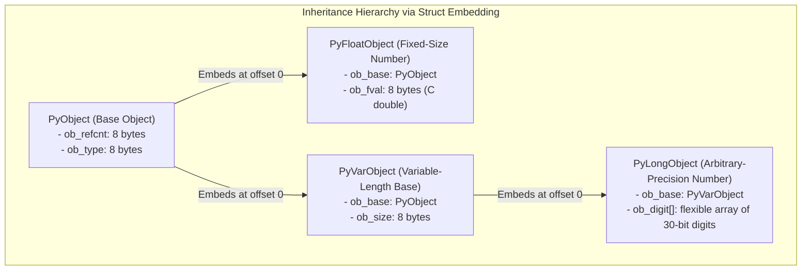
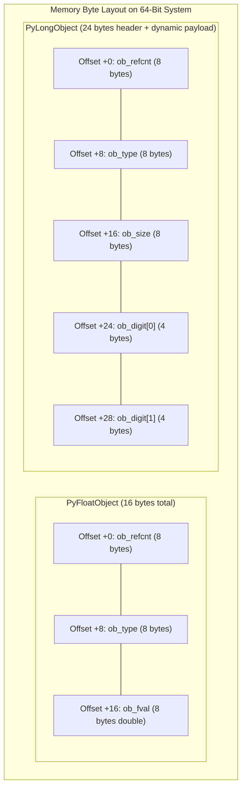
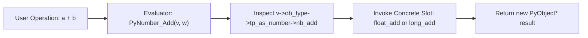
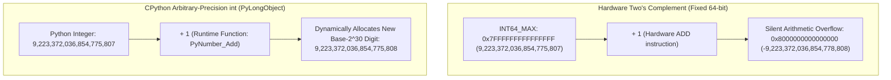
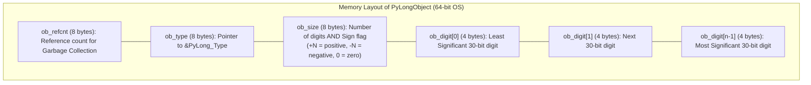
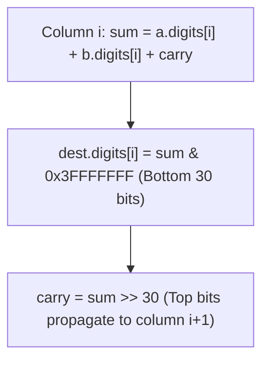

# The CPython Object Model and Subtyping in C

In CPython, all data types—integers, floats, strings, functions, classes—are objects represented by heap structures conforming to the `PyObject` protocol. Before studying arbitrary-precision integer algorithms, one must master how CPython implements polymorphism, single inheritance, and deterministic memory lifecycle in pure C.



## Subtyping Without Language Inheritance: C Struct Inlining
- C has no native classes or inheritance mechanisms.
- CPython implements single inheritance by inlining the base struct as the first field of every derived struct (the Jimmy Koppel subtyping principle).
- C standard guarantee (ISO C11 §6.7.2.1): A pointer to a structure object points to its initial member, and conversely.
- Because `ob_base` is always placed at byte offset 0:
  - Any pointer `PyFloatObject*` can be safely cast to `PyObject*`.
  - Any pointer `PyLongObject*` can be safely cast to `PyVarObject*` and `PyObject*`.
  - Generic runtime functions accept `PyObject*` and operate uniformly on any object in memory.



## Safe Macro Idioms in C: The `do { ... } while (0)` Pattern
- Macros like `Py_INCREF` and `Py_DECREF` expand to multiple statements.
- If written as a simple `{ ... }` block:
  ```c
  if (condition)
      Py_DECREF(x);
  else
      do_something_else();
  ```
  This expands into `{ ... }; else`, which is a syntax error because the semicolon terminates the `if` before `else`.
- Wrapping macros inside `do { ... } while (0)` solves this:
  - It forces the macro invocation to require a trailing semicolon (`Py_DECREF(x);`).
  - It nests cleanly inside any `if/else` construct without dangling branch hazards.
  - It scopes internal temporary variables (such as `PyObject *_py_op`) to prevent namespace collisions.

## Reference Counting Mechanics and Pre-Decrement Semantics
- In CPython, object reclamation is deterministic. When the last reference drops, the object is immediately destroyed.
- Why pre-decrement is strictly required:
  - `if (--op->ob_refcnt == 0)`: Decrements the count first, then tests if the *resulting* value is zero.
  - If one used post-decrement `if (op->ob_refcnt-- == 0)`: The condition tests the *old* value (checking if it was already zero), and decrements to `-1`. The destructor would never fire when refcount drops from 1 to 0!
- Destructor invocation:
  - Once `ob_refcnt == 0`, invoke the destructor slot: `op->ob_type->tp_dealloc(op)`.
  - The deallocator frees any internal dynamic buffers, then releases the object struct with `free(op)`.

## Dynamic Dispatch via C Virtual Method Tables (`PyTypeObject`)
- Dynamic polymorphism in CPython is achieved without C++ vtables through explicit type descriptor structures (`PyTypeObject`).
- Every object contains an `ob_type` pointer pointing to its type singleton (e.g. `&PyLong_Type`, `&PyFloat_Type`).
- Type slots organize behavior into protocol suites:
  - Basic slots: `tp_name`, `tp_basicsize`, `tp_itemsize`, `tp_dealloc`, `tp_repr`.
  - Number protocol: `tp_as_number` pointing to a `PyNumberMethods` struct containing function pointers (`nb_add`, `nb_subtract`, `nb_multiply`, `nb_invert`).
  - Sequence protocol: `tp_as_sequence` containing `sq_item`, `sq_concat`.
  - Mapping protocol: `tp_as_mapping` containing `mp_subscript`.



## Fixed-Size vs Variable-Length Objects
- CPython splits objects into two architectural categories:
  - Fixed-size objects: Memory size is known statically at compile time and does not change after allocation (e.g. `PyFloatObject`, `PyComplexObject`).
  - Variable-length objects: Objects whose payload size varies per instance (e.g. `PyLongObject`, `PyTupleObject`, `PyBytesObject`).
- Variable-length objects inline `PyVarObject` (which adds `ob_size`) and terminate with a flexible array member (`ob_digit[]` in `PyLongObject`, `ob_item[]` in `PyTupleObject`).
- Dynamic allocation formula:
  $$\text{Bytes} = \text{sizeof}(\text{PyLongObject}) + \text{size} \times \text{sizeof}(\text{digit})$$
- Zero-initialization invariant: Newly allocated digits must be wiped clean with `memset` to prevent reading uninitialized heap memory.

## Safe Systems Conversion: Handling `INT64_MIN`
- In Two's Complement signed 64-bit arithmetic, values range from $-2^{63}$ to $2^{63} - 1$:
  $$\text{INT64\_MIN} = -9,223,372,036,854,775,808$$
  $$\text{INT64\_MAX} = +9,223,372,036,854,775,807$$
- Notice that $| \text{INT64\_MIN} | = \text{INT64\_MAX} + 1$.
- In C, executing `-val` when `val == INT64_MIN` overflows signed integer range, producing **Undefined Behavior (UB)**.
- Systems solution using modular arithmetic:
  ```c
  uint64_t uval = (val < 0) ? (0ULL - (uint64_t)val) : (uint64_t)val;
  ```
  In C standard (§6.5.7), unsigned integer arithmetic is guaranteed never to overflow; it wraps modulo $2^{64}$. For `INT64_MIN` (`0x8000000000000000`), `0ULL - 0x8000000000000000` evaluates cleanly to `0x8000000000000000ULL` without UB!

## Case Study: The Minimal Concrete Numeric Type (`PyFloatObject`)
- To understand the object model without the algorithmic complexity of bignum math, examine `PyFloatObject`:
  - `ob_refcnt`: 8 bytes.
  - `ob_type`: Pointer to `PyFloat_Type`.
  - `ob_fval`: 8-byte C `double`.
- Addition (`float_add`) unwraps `((PyFloatObject*)v)->ob_fval + ((PyFloatObject*)w)->ob_fval`, allocates a new `PyFloatObject`, and returns it as `PyObject*`.
- Once this object-model pipeline is understood, `PyLongObject` simply substitutes fixed 8-byte hardware floats with base-$2^{30}$ dynamic digit arrays.

---

# The Fixed-Width Hardware Dilemma

In modern computer architectures, hardware integer arithmetic is bound to fixed physical register widths (typically 32 bits or 64 bits). These fixed-width integers rely universally on Two's Complement representation.



## Why Fixed-Width Hardware Fails Mathematical Invariants
- Mathematical integers ($\mathbb{Z}$) form an infinite set closed under addition, subtraction, and multiplication.
- Hardware registers represent a finite ring $\mathbb{Z} / 2^w \mathbb{Z}$ where $w \in \{8, 16, 32, 64\}$.
- When an addition exceeds $2^{w-1}-1$, the most significant bit flips, and Two's Complement silently wraps around to negative values without hardware exceptions (undefined behavior in signed C, modular wraparound in unsigned C).
- In high-level languages like Python, integers never overflow. Python 3 automatically promotes all integers to arbitrary-precision bignums (`PyLongObject`), bounded solely by the system's available virtual memory.

## Why Two's Complement is Abandoned for Arbitrary-Precision Bignums
- A beginner might wonder: *If Two's Complement is so elegant for 64-bit hardware, why doesn't CPython just chain dynamic arrays of 64-bit Two's Complement words together?*
- Computer scientists and language implementers universally abandon Two's Complement for multi-precision bignum libraries due to three fundamental issues:

### The Sign Extension Nightmare
- In Two's Complement, negative numbers have an infinite sequence of leading ones (`...11111111`).
- If an array of words expands from 2 words to 3 words, every single higher-order word must be sign-extended with all ones (`0xFFFFFFFF`).
- Truncating or clamping leading zero/one words requires continuous sign checks on dynamic array boundaries.

### Asymmetry of Negation
- In a Two's Complement word, `INT_MIN` cannot be negated because $| \text{INT\_MIN} | = \text{INT\_MAX} + 1$. Negating `INT_MIN` in Two's Complement forces an immediate reallocation and word resizing.

### Complex Multi-Word Multiplication and Division
- Multiplying two negative Two's Complement numbers requires specialized algorithms (like Booth's multiplication algorithm) or converting them to positive numbers before multiplication and re-negating afterward.
- **The Universal Expert Mental Model:** Treat the magnitude as a purely positive, unsigned polynomial in a massive mathematical base $B$, and store the sign as an isolated, independent flag. This architecture is called **Sign-Magnitude Representation**.

---

# CPython `PyLongObject` Internal Architecture

In CPython (the reference C implementation of Python), all integers are represented by the `PyLongObject` structure.



## Structure Definition in C
- In CPython's internal source code (`Include/cpython/longintrepr.h`), `PyLongObject` is defined as a variable-length object:

```c
typedef uint32_t digit;
typedef int32_t sdigit;
typedef uint64_t twodigits;
typedef int64_t stwodigits;

struct _longobject {
    PyObject_VAR_HEAD
    digit ob_digit[1]; // Flexible array member of base-2^30 digits
};
```

- `PyObject_VAR_HEAD` expands to:
  - `ob_refcnt`: Reference counter for memory management.
  - `ob_type`: Pointer to `PyLong_Type`.
  - `ob_size`: Variable size indicator (signed `Py_ssize_t`).

## The Dual Role of `ob_size`
- CPython avoids wasting a dedicated 8-byte struct field for the sign bit by overloading `ob_size`:
  - **Absolute Value ($|ob\_size|$):** Indicates the total number of 30-bit `digit` elements currently allocated and used in the `ob_digit` array.
  - **Sign of `ob_size`:** Encodes the mathematical sign:
    - If `ob_size > 0`, the integer is strictly positive.
    - If `ob_size < 0`, the integer is strictly negative.
    - If `ob_size == 0`, the integer is zero (and `ob_digit` contains zero active elements).

## The Base-$2^{30}$ Radix: Mathematical Value Equation
- The digits in `ob_digit` represent coefficients of a polynomial in base $2^{30}$ in little-endian order:
  $$\text{Value} = \text{sgn}(ob\_size) \times \sum_{i=0}^{|ob\_size|-1} \text{ob\_digit}[i] \times (2^{30})^i$$
- For example, if an integer spans three 30-bit digits:
  $$\text{Value} = \text{ob\_digit}[0] \times 2^0 + \text{ob\_digit}[1] \times 2^{30} + \text{ob\_digit}[2] \times 2^{60}$$

## The 30-Bit Digit Design Choice
- Why does CPython store only 30 bits of data inside a 32-bit integer (`uint32_t ob_digit`), leaving 2 bits completely unused per digit?
- This is one of the most brilliant engineering compromises in systems programming:

### The Hardware Multiplier Register Constraint
- When multiplying two $N$-bit numbers, the resulting product requires up to $2N$ bits of storage.
- If CPython utilized all 32 bits of `uint32_t`:
  - The maximum digit value is $2^{32} - 1$.
  - Multiplying two maximum digits yields:
    $$(2^{32} - 1) \times (2^{32} - 1) = 2^{64} - 2^{33} + 1$$
  - In schoolbook column multiplication, the algorithm must add the product of two digits to the existing column sum and the carry from the previous column:
    $$\text{Accumulator} = \text{prod} + \text{existing\_digit} + \text{carry}$$
  - $(2^{64} - 2^{33} + 1) + (2^{32} - 1) + (2^{32} - 1) > 2^{64} - 1$!
  - This immediately overflows the CPU's native 64-bit hardware registers (`uint64_t`), forcing the compiler to emit expensive 128-bit emulation instructions or non-portable inline assembly.

### The Headroom Proof for Base-$2^{30}$
- By restricting each digit to 30 bits (`PYLONG_BITS_IN_DIGIT == 30`):
  - Maximum digit value is $2^{30} - 1$.
  - Maximum product of two digits:
    $$(2^{30} - 1)^2 = 2^{60} - 2^{31} + 1$$
  - Adding the maximum carry ($2^{30} - 1$) and existing accumulator ($2^{30} - 1$):
    $$(2^{60} - 2^{31} + 1) + (2^{30} - 1) + (2^{30} - 1) < 2^{60} + 2^{31} \ll 2^{64} - 1$$
  - The entire intermediate sum comfortably fits within a standard 64-bit hardware unsigned integer (`uint64_t`) with 4 full bits of headroom!
  - The CPU can perform multiplication, addition, and carry extraction using fast single-cycle 64-bit hardware operations without any risk of register overflow.

## Small Integer Pre-Allocation Cache
- Creating heap-allocated `PyLongObject` structs for every single number introduces significant allocator overhead.
- Profiling Python programs reveals that small integers (especially loop counters, indexes, and status codes) account for over 90% of all integer operations.
- CPython optimizes this by pre-allocating an array of static `PyLongObject` singletons during interpreter initialization for the range:
  $$[-5, 256]$$
- Whenever any calculation produces a value in this range, CPython returns a borrowed pointer to the pre-allocated singleton rather than allocating new heap memory.
- This is why `a = 256; b = 256; a is b` evaluates to `True`, whereas `a = 257; b = 257; a is b` evaluates to `False`.

---

# How to Implement an Arbitrary-Precision Integer Engine in C

To master these concepts deeply, we implement an arbitrary-precision integer library (`BigInt`) from scratch in pure C, adhering to CPython's base-$2^{30}$ sign-magnitude architecture.

## Struct Design and Allocation
- We represent our bignum with an explicit sign, digit count, capacity, and a dynamically resized heap array of 30-bit digits:

```c
#include <stdio.h>
#include <stdlib.h>
#include <stdint.h>
#include <string.h>
#include <assert.h>

#define BASE_BITS 30
#define BASE_MASK ((1U << BASE_BITS) - 1) // 0x3FFFFFFF
#define BASE      (1ULL << BASE_BITS)      // 1,073,741,824

typedef struct {
    int sign;          // +1 for positive, -1 for negative, 0 for zero
    size_t size;       // Number of active 30-bit digits
    size_t capacity;   // Allocated capacity of digits array
    uint32_t *digits;  // Little-endian base-2^30 digit array
} BigInt;

void bigint_init(BigInt *b, size_t capacity) {
    b->sign = 0;
    b->size = 0;
    b->capacity = capacity > 0 ? capacity : 1;
    b->digits = calloc(b->capacity, sizeof(uint32_t));
    assert(b->digits != NULL);
}

void bigint_free(BigInt *b) {
    free(b->digits);
    b->digits = NULL;
    b->size = 0;
    b->capacity = 0;
    b->sign = 0;
}

void bigint_ensure_capacity(BigInt *b, size_t needed) {
    if (needed <= b->capacity) return;
    size_t new_cap = b->capacity * 2;
    if (new_cap < needed) new_cap = needed;
    uint32_t *new_digits = realloc(b->digits, new_cap * sizeof(uint32_t));
    assert(new_digits != NULL);
    memset(new_digits + b->capacity, 0, (new_cap - b->capacity) * sizeof(uint32_t));
    b->digits = new_digits;
    b->capacity = new_cap;
}

// Strip leading zero digits and normalize sign
void bigint_clamp(BigInt *b) {
    while (b->size > 0 && b->digits[b->size - 1] == 0) {
        b->size--;
    }
    if (b->size == 0) {
        b->sign = 0;
    }
}
```

## Conversion from Native C Integers
- Translating a 64-bit hardware integer into base-$2^{30}$ digits:

```c
void bigint_from_int(BigInt *b, int64_t val) {
    b->size = 0;
    if (val == 0) {
        b->sign = 0;
        return;
    }
    if (val < 0) {
        b->sign = -1;
        val = -val;
    } else {
        b->sign = 1;
    }

    uint64_t uval = (uint64_t)val;
    while (uval > 0) {
        bigint_ensure_capacity(b, b->size + 1);
        b->digits[b->size++] = (uint32_t)(uval & BASE_MASK);
        uval >>= BASE_BITS;
    }
}
```

## Magnitude Comparison
- Comparing absolute values $|a|$ and $|b|$ before addition and subtraction:

```c
int bigint_compare_magnitude(const BigInt *a, const BigInt *b) {
    if (a->size > b->size) return 1;
    if (a->size < b->size) return -1;
    for (size_t i = a->size; i > 0; i--) {
        if (a->digits[i - 1] > b->digits[i - 1]) return 1;
        if (a->digits[i - 1] < b->digits[i - 1]) return -1;
    }
    return 0;
}
```

## Grade-School Column Addition
- Addition operates on columns from index 0 upward, propagating carries:



```c
static void bigint_add_magnitude(BigInt *dest, const BigInt *a, const BigInt *b) {
    size_t max_size = a->size > b->size ? a->size : b->size;
    bigint_ensure_capacity(dest, max_size + 1);

    uint64_t carry = 0;
    dest->size = 0;

    for (size_t i = 0; i < max_size || carry > 0; i++) {
        uint64_t sum = carry;
        if (i < a->size) sum += a->digits[i];
        if (i < b->size) sum += b->digits[i];

        dest->digits[i] = (uint32_t)(sum & BASE_MASK);
        carry = sum >> BASE_BITS;
        dest->size = i + 1;
    }
    bigint_clamp(dest);
}
```

## Grade-School Column Subtraction
- Subtraction processes columns with borrow propagation, requiring $|a| \ge |b|$:

```c
static void bigint_sub_magnitude(BigInt *dest, const BigInt *a, const BigInt *b) {
    bigint_ensure_capacity(dest, a->size);
    int64_t borrow = 0;
    dest->size = a->size;

    for (size_t i = 0; i < a->size; i++) {
        int64_t diff = (int64_t)a->digits[i] - borrow;
        if (i < b->size) diff -= b->digits[i];

        if (diff < 0) {
            diff += (int64_t)BASE;
            borrow = 1;
        } else {
            borrow = 0;
        }
        dest->digits[i] = (uint32_t)diff;
    }
    assert(borrow == 0);
    bigint_clamp(dest);
}
```

## Signed Dispatcher for Addition
- The public `bigint_add` inspects signs and dispatches to magnitude addition or subtraction:

```c
void bigint_add(BigInt *dest, const BigInt *a, const BigInt *b) {
    if (a->sign == 0) {
        dest->sign = b->sign;
        bigint_ensure_capacity(dest, b->size);
        memcpy(dest->digits, b->digits, b->size * sizeof(uint32_t));
        dest->size = b->size;
        return;
    }
    if (b->sign == 0) {
        dest->sign = a->sign;
        bigint_ensure_capacity(dest, a->size);
        memcpy(dest->digits, a->digits, a->size * sizeof(uint32_t));
        dest->size = a->size;
        return;
    }

    if (a->sign == b->sign) {
        bigint_add_magnitude(dest, a, b);
        dest->sign = a->sign;
    } else {
        int cmp = bigint_compare_magnitude(a, b);
        if (cmp >= 0) {
            bigint_sub_magnitude(dest, a, b);
            dest->sign = (dest->size == 0) ? 0 : a->sign;
        } else {
            bigint_sub_magnitude(dest, b, a);
            dest->sign = (dest->size == 0) ? 0 : b->sign;
        }
    }
}
```

## Multiplication with 64-Bit Intermediate Accumulators
- Schoolbook multiplication $O(N \times M)$ leverages C's native 64-bit `uint64_t` registers:

```c
void bigint_mul(BigInt *dest, const BigInt *a, const BigInt *b) {
    if (a->sign == 0 || b->sign == 0) {
        dest->sign = 0;
        dest->size = 0;
        return;
    }

    BigInt temp;
    bigint_init(&temp, a->size + b->size);
    temp.size = a->size + b->size;

    for (size_t i = 0; i < a->size; i++) {
        uint64_t carry = 0;
        for (size_t j = 0; j < b->size || carry > 0; j++) {
            uint64_t prod = (uint64_t)temp.digits[i + j] + carry;
            if (j < b->size) {
                // Guaranteed not to overflow uint64_t because digits are 30 bits!
                prod += (uint64_t)a->digits[i] * (uint64_t)b->digits[j];
            }
            temp.digits[i + j] = (uint32_t)(prod & BASE_MASK);
            carry = prod >> BASE_BITS;
        }
    }

    temp.sign = (a->sign == b->sign) ? 1 : -1;
    bigint_clamp(&temp);

    // Copy result into destination
    bigint_ensure_capacity(dest, temp.size);
    memcpy(dest->digits, temp.digits, temp.size * sizeof(uint32_t));
    dest->size = temp.size;
    dest->sign = temp.sign;

    bigint_free(&temp);
}
```

---

# The Semantic Bridge: Two's Complement Semantics from Sign-Magnitude Storage

One of the most fascinating engineering aspects of CPython is that **Python exposes Two's Complement semantics to the user**, even though its internal data structures are strictly sign-magnitude.

## The Behavior of Bitwise NOT (`~`) in Python
- If you run `~5` in Python, the output is `-6`.
- If you run `~(-5)` in Python, the output is `4`.
- How does Python achieve this without storing numbers in Two's Complement?
- CPython implements bitwise NOT by exploiting the universal algebraic definition of Two's Complement negation:
  $$-x = \sim x + 1 \implies \sim x = -(x + 1)$$
- When you execute `~x` in Python, CPython executes:
  `PyNumber_Negative(PyNumber_Add(x, 1))`
  No bit manipulation occurs at all! It adds 1 to the number and flips the sign flag in `ob_size`.

## Emulating Infinite Sign Bits for Binary Operations (`&`, `|`, `^`)
- In Two's Complement, positive numbers have an infinite sequence of leading `0`s, and negative numbers have an infinite sequence of leading `1`s.
- When performing `x & y` where $x < 0$ and $y > 0$:
  - CPython conceptually extends $x$ into infinite Two's Complement bits.
  - It converts the magnitude of the negative operand into Two's Complement form on the fly.
  - It executes the bitwise AND operation across the digit array.
  - It converts the resulting Two's Complement representation back into positive sign-magnitude storage.

---

# Active Recall & Socratic Checkpoints

## Checkpoint 1: The Headroom Calculation
- *Question:* If a 64-bit CPU has 64-bit registers, why doesn't CPython use 32 bits per digit in `ob_digit` to save 6.25% memory?
- *Explanation:* Because multiplying two 32-bit numbers produces a 64-bit product ($2^{64}-2^{33}+1$). Adding column carries to this product exceeds $2^{64}-1$, causing silent hardware overflow in standard 64-bit registers. Using 30 bits ensures that the product plus carries never exceeds $2^{60}$, executing safely in 64-bit hardware registers.

## Checkpoint 2: The Sign of Zero
- *Question:* How does CPython distinguish between $+0$ and $-0$?
- *Explanation:* It does not allow `-0`. When `ob_size == 0`, the number is defined as zero, and the sign is neutral. The `bigint_clamp` function strips all leading zero digits; if the digit count drops to zero, `ob_size` is unconditionally set to 0.

## Checkpoint 3: Memory Footprint Comparison
- *Question:* What is the minimum memory footprint of the integer `1` in C versus Python 3?
- *Explanation:* In C, `int` consumes exactly 4 bytes on the stack or in a register. In Python 3 on a 64-bit OS, `1` is a heap-allocated `PyLongObject` consuming 28 bytes: 8 bytes for `ob_refcnt`, 8 bytes for `ob_type`, 8 bytes for `ob_size`, and 4 bytes for `ob_digit[0]` (padded to 28 or 32 bytes for alignment).
