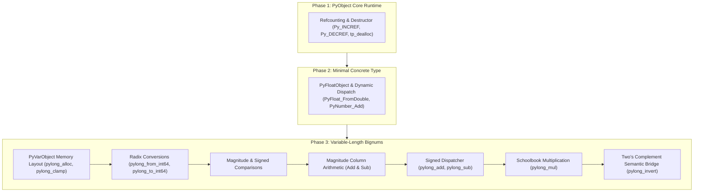

# Progressive Deliberate Practice Curriculum

This workbook guides your hands-on mastery of CPython's object system and arbitrary-precision integer runtime. It follows the 3-phase curriculum: foundational runtime $\to$ minimal concrete type $\to$ variable-length bignum.

---

# Phase 1: The Core PyObject Protocol & Reference Counting

## Mental Model & Concept Map
- Reference: [CONCEPTS.md#the-cpython-object-model-and-subtyping-in-c](file:///Users/bradleyyeo/Documents/learn/csapp3e-brad/cpython_int/CONCEPTS.md#L1-L95).
- Every object in Python is fundamentally a [PyObject](file:///Users/bradleyyeo/Documents/learn/csapp3e-brad/cpython_int/cpython_int.h#L47-L50) header containing:
  - `ob_refcnt`: 64-bit reference counter.
  - `ob_type`: Pointer to a [PyTypeObject](file:///Users/bradleyyeo/Documents/learn/csapp3e-brad/cpython_int/cpython_int.h#L35-L42) (vtable).
- Variable-length objects extend [PyVarObject](file:///Users/bradleyyeo/Documents/learn/csapp3e-brad/cpython_int/cpython_int.h#L53-L56), adding `ob_size`.
- Destructor rule: When `ob_refcnt` drops to zero, the runtime must invoke `op->ob_type->tp_dealloc(op)` to reclaim memory.

## Progressive PyObject Drills

### Drill 1.1: Struct Field Accessors as Lvalue Macros
- Targets: `Py_REFCNT(op)`, `Py_TYPE(op)`, `Py_SIZE(op)` in [cpython_int.h](file:///Users/bradleyyeo/Documents/learn/csapp3e-brad/cpython_int/cpython_int.h#L58-L62).
- Test: `test_phase1_pyobject_accessors` in [test_cpython_int.c](file:///Users/bradleyyeo/Documents/learn/csapp3e-brad/cpython_int/test_cpython_int.c).
- Concept: In C, a macro expanding to a struct member dereference (e.g. `(((PyObject *)(op))->ob_refcnt)`) is an **lvalue**. This means you can both read from it (`val = Py_REFCNT(op);`) and assign to it (`Py_REFCNT(op) = 1;`).

### Drill 1.2: Standard Object Initializers
- Targets: `PyObject_Init(op, type)` and `PyObject_InitVar(op, type, size)` in [cpython_int.c](file:///Users/bradleyyeo/Documents/learn/csapp3e-brad/cpython_int/cpython_int.c).
- Tests: `test_phase1_pyobject_init` and `test_phase1_pyvarobject_init` in [test_cpython_int.c](file:///Users/bradleyyeo/Documents/learn/csapp3e-brad/cpython_int/test_cpython_int.c).
- Invariant: `PyObject_Init` guarantees `ob_refcnt = 1` and sets `ob_type`. `PyObject_InitVar` chains to `PyObject_Init` and sets `ob_size = size`.

### Drill 1.3: Reference Counting Primitives
- Targets: `Py_INCREF(op)` and `Py_DECREF(op)` in [cpython_int.h](file:///Users/bradleyyeo/Documents/learn/csapp3e-brad/cpython_int/cpython_int.h#L58-L62).
- Test: `test_phase1_pyobject_refcount_and_dealloc` in [test_cpython_int.c](file:///Users/bradleyyeo/Documents/learn/csapp3e-brad/cpython_int/test_cpython_int.c).
- Invariant: `Py_DECREF` must use pre-decrement `if (--_py_op->ob_refcnt == 0)` and call `tp_dealloc` when reaching zero.

### Drill 1.4: NULL-Safe Macro Variants
- Targets: `Py_XINCREF(op)` and `Py_XDECREF(op)` in [cpython_int.h](file:///Users/bradleyyeo/Documents/learn/csapp3e-brad/cpython_int/cpython_int.h#L58-L62).
- Test: `test_phase1_pyobject_null_safety` in [test_cpython_int.c](file:///Users/bradleyyeo/Documents/learn/csapp3e-brad/cpython_int/test_cpython_int.c).
- Invariant: Must safely accept `NULL` pointers without performing any operation or dereference.

## Active Recall Checkpoint
- Why does CPython provide macros like `Py_REFCNT` rather than having external code access struct fields directly?
- What is the difference between `Py_DECREF` and `Py_XDECREF`? When must you use `Py_XDECREF`?

---

# Phase 2: Minimal Concrete Type (PyFloatObject) & Dynamic Dispatch

## Mental Model & Concept Map
- Reference: [CONCEPTS.md#dynamic-dispatch-via-c-virtual-method-tables-pytypeobject](file:///Users/bradleyyeo/Documents/learn/csapp3e-brad/cpython_int/CONCEPTS.md#L36-L52) & [CONCEPTS.md#case-study-the-minimal-concrete-numeric-type-pyfloatobject](file:///Users/bradleyyeo/Documents/learn/csapp3e-brad/cpython_int/CONCEPTS.md#L60-L68).
- Subtyping via struct inlining: [PyFloatObject](file:///Users/bradleyyeo/Documents/learn/csapp3e-brad/cpython_int/cpython_int.h#L81-L84) embeds `PyObject ob_base` at offset 0.
- Dynamic Dispatch: `PyNumber_Add(v, w)` inspects `v->ob_type->tp_as_number->nb_add(v, w)`.

## Implementation Targets
- Constructor: [PyFloat_FromDouble](file:///Users/bradleyyeo/Documents/learn/csapp3e-brad/cpython_int/cpython_int.c#L73-L80).
- Slot methods: [float_add](file:///Users/bradleyyeo/Documents/learn/csapp3e-brad/cpython_int/cpython_int.c#L23-L30), [float_multiply](file:///Users/bradleyyeo/Documents/learn/csapp3e-brad/cpython_int/cpython_int.c#L32-L39), [float_dealloc](file:///Users/bradleyyeo/Documents/learn/csapp3e-brad/cpython_int/cpython_int.c#L19-L21).
- Polymorphic dispatcher: [PyNumber_Add](file:///Users/bradleyyeo/Documents/learn/csapp3e-brad/cpython_int/cpython_int.c#L87-L94).
- Verifiable test: `test_phase2_pyfloat_and_dispatch` in [test_cpython_int.c](file:///Users/bradleyyeo/Documents/learn/csapp3e-brad/cpython_int/test_cpython_int.c#L50-L75).

## Practice Drill
- Challenge: Empty [PyNumber_Add](file:///Users/bradleyyeo/Documents/learn/csapp3e-brad/cpython_int/cpython_int.c#L87-L94) and implement dynamic slot lookup and dispatch.
- Validation: Run `make test` to verify that `PyNumber_Add(f1, f2)` dynamically dispatches to `float_add` and returns a valid `PyObject*` wrapping the float sum.

## Active Recall Checkpoint
- Why does `(PyObject*)float_obj` point to the exact same memory address as `float_obj`?
- How does `PyNumber_Add` achieve polymorphism without knowing the concrete type at compile time?

---

# Phase 3: Variable-Length Bignums (PyVarObject & PyLongObject)

## Mental Model & Concept Map
- Reference: [CONCEPTS.md#cpython-pylongobject-internal-architecture](file:///Users/bradleyyeo/Documents/learn/csapp3e-brad/cpython_int/CONCEPTS.md#L117-L203).
- Variable-length hierarchy: [PyLongObject](file:///Users/bradleyyeo/Documents/learn/csapp3e-brad/cpython_int/cpython_int.h#L99-L102) embeds [PyVarObject](file:///Users/bradleyyeo/Documents/learn/csapp3e-brad/cpython_int/cpython_int.h#L48-L51), which embeds [PyObject](file:///Users/bradleyyeo/Documents/learn/csapp3e-brad/cpython_int/cpython_int.h#L43-L46).
- Single allocation: A single call to `malloc(sizeof(PyLongObject) + n * sizeof(digit))` allocates the `PyObject` header, `ob_size`, and all digits.
- Base-$2^{30}$ arithmetic: 30-bit digits guarantee that `(digit * digit) + existing + carry` never overflows native 64-bit hardware registers (`uint64_t`).

## Progressive Bignum Drills
### Drill 3.1: Memory Allocation & Clamping
- Targets: [pylong_alloc](file:///Users/bradleyyeo/Documents/learn/csapp3e-brad/cpython_int/cpython_int.c#L108-L123), [pylong_clamp](file:///Users/bradleyyeo/Documents/learn/csapp3e-brad/cpython_int/cpython_int.c#L133-L150).
- Test: `test_layer1_alloc_and_clamp`.
- Invariant: Zero must have `ob_size == 0`; no leading zeros.

### Drill 3.2: Radix Conversions
- Targets: [pylong_from_int64](file:///Users/bradleyyeo/Documents/learn/csapp3e-brad/cpython_int/cpython_int.c#L179-L200), [pylong_to_int64](file:///Users/bradleyyeo/Documents/learn/csapp3e-brad/cpython_int/cpython_int.c#L202-L239).
- Test: `test_layer2_conversions`.
- Invariant: Handle `INT64_MIN` safely using `uint64_t` two's complement inversion.

### Drill 3.3: Comparisons
- Targets: [pylong_compare_magnitude](file:///Users/bradleyyeo/Documents/learn/csapp3e-brad/cpython_int/cpython_int.c#L241-L255), [pylong_compare](file:///Users/bradleyyeo/Documents/learn/csapp3e-brad/cpython_int/cpython_int.c#L257-L270).
- Test: `test_layer3_comparisons`.

### Drill 3.4: Magnitude Column Arithmetic
- Targets: [pylong_add_magnitude](file:///Users/bradleyyeo/Documents/learn/csapp3e-brad/cpython_int/cpython_int.c#L272-L305), [pylong_sub_magnitude](file:///Users/bradleyyeo/Documents/learn/csapp3e-brad/cpython_int/cpython_int.c#L307-L343).
- Test: `test_layer4_magnitude_arithmetic`.
- Invariant: Carry extraction via `sum >> 30`; borrow propagation with signed 64-bit integer.

### Drill 3.5: Signed Dispatcher
- Targets: [pylong_neg](file:///Users/bradleyyeo/Documents/learn/csapp3e-brad/cpython_int/cpython_int.c#L345-L356), [pylong_add](file:///Users/bradleyyeo/Documents/learn/csapp3e-brad/cpython_int/cpython_int.c#L358-L401), [pylong_sub](file:///Users/bradleyyeo/Documents/learn/csapp3e-brad/cpython_int/cpython_int.c#L403-L410).
- Test: `test_layer5_signed_arithmetic`.

### Drill 3.6: Schoolbook Multiplication
- Targets: [pylong_mul](file:///Users/bradleyyeo/Documents/learn/csapp3e-brad/cpython_int/cpython_int.c#L412-L446).
- Test: `test_layer6_multiplication`.
- Invariant: 30-bit digit headroom ensures intermediate accumulation fits within `uint64_t`.

### Drill 3.7: Two's Complement Semantic Bridge
- Targets: [pylong_invert](file:///Users/bradleyyeo/Documents/learn/csapp3e-brad/cpython_int/cpython_int.c#L448-L460).
- Test: `test_layer7_twos_complement`.
- Invariant: Compute `~x` algebraically via `-(x + 1)`.

### Drill 3.8: Polymorphic Integration
- Target: Integrating `pylong_add` into `PyLong_Type.tp_as_number->nb_add`.
- Test: `test_phase3_pylong_polymorphic_dispatch`.
- Invariant: `PyNumber_Add((PyObject*)l1, (PyObject*)l2)` operates identically to Python bytecode evaluation.
