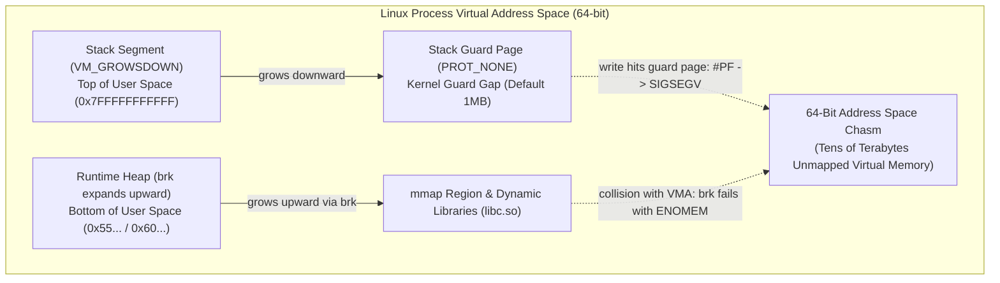

# Stage 3: Exercise 07 - Process Virtual Memory Layout

A foundational guide explaining the virtual address space topography: Text, Initialized Data (.data), Uninitialized Data (.bss), Runtime Heap, and Stack downward growth for C beginners.

# Conceptual Foundations and Mental Model

## Virtual Memory Topography
- Modern operating systems give each process the illusion of a vast, contiguous, private address space (up to 48 or 57 bits on 64-bit platforms).
- The classic Unix process address space is organized from lowest to highest virtual address:
  - `.text` Segment: Executable machine code instructions. Marked read-only and executable (`r-x`) to prevent self-modifying code or accidental overwriting.
  - `.data` Segment: Global and static variables that have an explicit initial value at compile time (e.g. `static int count = 10;`). Marked read-write (`rw-`).
  - `.bss` Segment: Global and static variables that are uninitialized or initialized to zero (e.g. `static int buffer[1024];`). Takes zero space in the executable binary on disk; the OS zero-fills these pages upon demand. Marked read-write (`rw-`).
  - Runtime Heap: Grows upward from lower to higher memory addresses as memory is dynamically requested via `malloc`/`calloc`/`sbrk`.
  - Memory Mapping Area (`mmap`): Shared libraries and file-backed mappings reside between the heap and the stack.
  - Runtime Stack: Stores local variables, function return addresses, and register spill slots. On x86_64 and ARM64 systems, the stack grows downwards (from high memory addresses toward lower memory addresses).

## Why the Stack Grows Downward
- Placing the heap at the bottom growing upward and the stack at the top growing downward allows both dynamic regions to expand towards each other into the large unallocated middle area of virtual memory without pre-allocating fixed boundaries.

# Stack and Heap Collision: Kernel and Hardware Protection Mechanisms

## Modern Operating System Behavior: Immediate Crash via SIGSEGV
- Under modern Linux and Unix kernels, the stack and heap cannot silently overwrite one another.
- Attempting to collide them triggers an immediate Segmentation Fault (`SIGSEGV`) delivered by the kernel.
- The collision is trapped at the hardware MMU level via page faults before memory corruption can take place.



## Kernel and Hardware Protection Mechanisms

### Guard Pages and Demand Paging
- The Linux kernel maps the process stack as a Virtual Memory Area (VMA) with the `VM_GROWSDOWN` flag.
- A guard page with `PROT_NONE` permissions sits immediately beneath the lowest address of the stack.
- As function call frames expand downward, touching the next page boundary triggers a minor page fault, prompting the kernel to allocate a physical page and shift the guard page downward.
- Once the stack reaches its maximum allocated ceiling (`RLIMIT_STACK`, typically 8MB on Linux), the kernel refuses to expand the VMA.
- The next write instruction strikes the protected guard page, triggering a page fault exception (`#PF`) that the kernel terminates with `SIGSEGV`.

### Heap Boundary Checking via brk and mmap
- The runtime heap expands upward via the `brk(2)` system call.
- The Linux kernel verifies that the requested program break address does not intersect an existing VMA (such as an `mmap` region, shared library, or stack).
- If the heap encounters an existing mapping or exceeds memory limits, `brk(2)` rejects the expansion and returns `ENOMEM`.
- The C runtime catches this failure, causing [`malloc`](file:///Users/bradleyyeo/Documents/learn/csapp3e-brad/exercises/07_process_memory_layout.c#L145) to fail safely by returning `nullptr`.

### The 64-Bit Address Space Chasm
- In 64-bit virtual memory (see [`07_process_memory_layout.md`](file:///Users/bradleyyeo/Documents/learn/csapp3e-brad/exercises/07_process_memory_layout.md)), user space spans 128 TB (48-bit) to 64 PB (57-bit).
- The stack is anchored near the top of user space (`0x7FFF...`), while the heap begins near the bottom (`0x55...` or `0x60...`).
- The unallocated gap between them is tens of terabytes wide and contains intermediate memory mappings (`mmap`) and shared libraries (`libc.so`).
- Processes exhaust physical memory and swap commit limits long before the `brk` heap could physically bridge the gap to the main thread's stack.

## Historical and Edge-Case Vulnerabilities

### Bare Metal and MMU-Less Embedded Systems
- In microcontrollers, bare-metal architectures, or real-mode operating systems lacking hardware paging/MMUs, the stack and heap share a single physical address block.
- A collision causes silent, catastrophic corruption:
  - Stack pushes overwrite heap chunk metadata, corrupting memory managers.
  - Heap writes overwrite activation records and return addresses, resulting in arbitrary execution flow or hard faults.

### The Stack Clash Attack Vector
- Historically, if a program allocated an exceptionally large stack buffer in a single instruction (e.g. `alloca(10MB)` or large local arrays), the stack pointer register (`%rsp`) could skip over a small 4KB guard page without dereferencing it.
- Landing directly in an adjacent `mmap` or heap allocation allowed an attacker to overwrite memory without tripping the guard page.
- Modern mitigations:
  - The Linux kernel expanded the default stack guard gap to 1MB.
  - Modern compilers offer `-fstack-clash-protection`, which generates probing instructions (`test` or `or`) at every 4KB page boundary during stack growth to guarantee the guard page is touched and trips `SIGSEGV`.

---

# Line-by-Line Code Breakdown

## Type Definition: SegmentType (Typedef vs Tagged Enum)

```c
typedef enum {
  SEG_UNKNOWN = 0,
  SEG_TEXT,
  SEG_DATA,
  SEG_BSS,
  SEG_HEAP,
  SEG_STACK
} SegmentType;
```

### Tag Namespace vs Ordinary Identifier Namespace
- In C, identifiers following `enum`, `struct`, or `union` reside in a separate "tag namespace". In [04_enum_state_machine.c](file:///Users/bradleyyeo/Documents/learn/csapp3e-brad/exercises/04_enum_state_machine.c), `enum PatternKind` requires prefixing `enum` on every variable declaration and function signature (`static enum PatternKind classify_token(...)`).
- Using `typedef enum { ... } SegmentType;` binds the name directly into the ordinary identifier namespace, allowing direct use as a first-class type: `SegmentType seg = SEG_TEXT;`.
- Design tradeoff: Anonymous typedefs cannot be forward-declared in header files. When forward declaration across modules is required, pair the tag with the typedef: `typedef enum SegmentType SegmentType;`.

---

## Segment Sampling and Declarations

```c
static int g_initialized_data = 100;
static int g_uninitialized_bss;

static void dummy_function(void) {
}
```

### Static Storage Duration
- `g_initialized_data` has non-zero initial value `100`, placing it in `.data`.
- `g_uninitialized_bss` has no initial value, placing it in `.bss`.
- `&dummy_function` yields the memory address of the first instruction in `.text`.

---

## Function: sample_nested_stack

```c
static void sample_nested_stack(uintptr_t *out_addr) {
  int nested_local = 0;
  *out_addr = (uintptr_t)&nested_local;
}
```

### Stack Frame Sampling
- When `sample_nested_stack` is called, the CPU pushes a new activation frame onto the stack.
- The local variable `nested_local` is allocated in this new frame.
- Its address `&nested_local` is strictly less than variables in the parent frame, proving downward growth.

### Hardware and ABI Mechanics of Downward Stack Growth
- Stack Pointer Register: On x86_64 (`%rsp`) and ARM64 (`sp`), the stack pointer register tracks the lowest address currently in use by the stack. Pushing data or allocating stack space decrements this register.
- Instruction Pointer Push: When the parent function executes the `call` instruction, the CPU hardware pushes the 8-byte return address onto the stack, immediately subtracting 8 bytes from `%rsp` (`%rsp = %rsp - 8`).
- Frame Pointer Setup: Standard calling conventions execute `push %rbp` in the function prologue, subtracting an additional 8 bytes from `%rsp`.
- Local Variable Allocation: The compiler reserves space for callee local variables by subtracting the required byte size directly from the stack pointer (e.g., `sub $16, %rsp`).
- Address Inequality Proof: The local variable `nested_local` resides in the memory range reserved by the callee's lowered stack pointer (`%rsp_callee`). Because parent variables (such as `local_stack_var` in `main`) were allocated before the `call` instruction decremented `%rsp`, they occupy higher numerical virtual addresses:
  `&nested_local <= %rsp_callee < %rsp_parent <= &local_stack_var`
- Result: The condition `(uintptr_t)&local_stack_var > (uintptr_t)&nested_local` always evaluates to true, providing deterministic, hardware-level proof of downward stack expansion.

---

## Function: classify_segment

```c
static SegmentType classify_segment(uintptr_t addr, const MemoryBounds *bounds) {
  if (addr == 0 || bounds == nullptr) {
    return SEG_UNKNOWN;
  }

  if (addr < bounds->data_sample) {
    return SEG_TEXT;
  } else if (addr < bounds->bss_sample) {
    return SEG_DATA;
  } else if (addr < bounds->heap_sample) {
    return SEG_BSS;
  } else if (addr < bounds->stack_sample) {
    return SEG_HEAP;
  } else {
    return SEG_STACK;
  }
}
```

### Relative Range Classification
- Compares numeric address `addr` against runtime sample pointers.
- Because Unix virtual memory orders segments monotonically (`text < data < bss < heap < stack`), simple monotonic threshold checks accurately classify any sample address.

---

## Function: calculate_stack_growth_offset

```c
static ptrdiff_t calculate_stack_growth_offset(uintptr_t parent_frame) {
  if (parent_frame == 0) {
    return 0;
  }

  int child_local = 0;
  return (ptrdiff_t)(parent_frame - (uintptr_t)&child_local);
}
```

### Downward Growth Verification
- If stack grows downwards: `parent_frame > &child_local`, yielding a positive `ptrdiff_t`.
- On x86_64 / ARM64 macOS, this difference is typically between 32 and 64 bytes (the size of the call frame).

---

# Memory Layout Visualization

Standard Unix virtual address space layout:

```
High Memory: 0x7FFFFFFFFFFF
  +-----------------------------------+
  |               STACK               |   |  Stack grows DOWNWARDS (v)
  |  (local vars, frame pointers)     |   v
  +-----------------------------------+
  |                 |                 |
  |                 v                 |
  |                                   |
  |                 ^                 |
  |                 |                 |
  +-----------------------------------+
  |               HEAP                |   ^  Heap grows UPWARDS (^)
  |  (malloc, calloc, realloc)        |   |
  +-----------------------------------+
  |               .bss                |   Read-Write, Zero-Initialized
  |  (uninitialized static/globals)   |
  +-----------------------------------+
  |              .data                |   Read-Write, Initialized
  |  (initialized static/globals)     |
  +-----------------------------------+
  |              .text                |   Read-Only, Executable (Code)
  |  (machine instructions)           |
  +-----------------------------------+
Low Memory:  0x000000000000
```

---

# Active Recall and Validation Drills

## Drill: Active Recall Questions
- Question 1: Why does an uninitialized global array of 1,000,000 integers (`static int big[1000000];`) take almost 0 bytes in the compiled executable binary on disk?
- Question 2: What happens at the hardware/OS level if code tries to write to an address inside the `.text` segment?
- Question 3: How does Address Space Layout Randomization (ASLR) alter the absolute addresses of these segments across program executions while preserving their relative ordering?

## Drill: Hands-On Code Validation
- Open [07_process_memory_layout.c](file:///Users/bradleyyeo/Documents/learn/csapp3e-brad/exercises/07_process_memory_layout.c).
- Add a recursive function `verify_stack_depth(int depth, uintptr_t prev_addr)` that recurses 5 times, printing the difference `prev_addr - current_addr` on each recursion level.
- Observe whether stack frame spacing remains constant across recursive calls.
- Compile and run:
  ```bash
  clang -std=c23 -Wall -Wextra -Werror -pedantic -g -o 07_process_memory_layout 07_process_memory_layout.c
  ./07_process_memory_layout
  ```

## Drill: Socratic Implementation Challenge (Heap Upward Growth)

### Socratic Inquiries (Mental Model Verification)
- Socratic Question 1: If the stack grows downward because activation frames are pushed toward lower addresses (`parent_frame > child_frame`), which direction should consecutive heap allocations move in virtual memory?
- Socratic Question 2: When you invoke `malloc(sizeof(int))` twice in succession without intervening deallocations, what relational invariant must hold between `(uintptr_t)first_ptr` and `(uintptr_t)second_ptr`?
- Socratic Question 3: Why must both pointers be explicitly deallocated with `free()`, and how do you ensure the offset calculation does not dereference dangling pointers?

### Implementation Specification
- Function signature:
  ```c
  static ptrdiff_t calculate_heap_growth_offset(void);
  ```
- Allocation: Allocate two distinct blocks (`first` and `second`) of `sizeof(int)`.
- Defensive check: If either allocation fails (`nullptr`), free any allocated block and return `0`.
- Invariant calculation: Compute `(ptrdiff_t)((uintptr_t)second - (uintptr_t)first)`.
- Cleanup: Free both blocks before returning to prevent memory leaks.
- Verification in `main()`:
  ```c
  ptrdiff_t heap_growth = calculate_heap_growth_offset();
  assert(heap_growth > 0);
  ```

---

# Next Step in Curriculum
Proceed to [09_dynamic_memory_lifecycle.md](file:///Users/bradleyyeo/Documents/learn/csapp3e-brad/exercises/09_dynamic_memory_lifecycle.md) to master dynamic memory allocation (`malloc`, `calloc`, `realloc`, `free`), safe reallocation idioms, and zeroing pointers.
